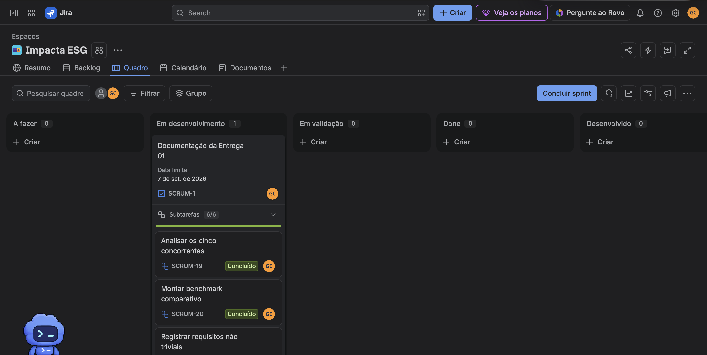

# Impacta ESG

Aplicação web para ajudar pequenas e médias empresas a dar os primeiros passos em ESG e acompanhar os resultados das ações escolhidas.

> Projeto da disciplina Fundamentos de Desenvolvimento de Software, turma 2026.2.

## O problema

Muitas PMEs sabem que ESG é importante, mas não sabem por onde começar. Também é difícil relacionar uma prática a um resultado da empresa. O desafio proposto pela Deloitte é tornar o tema mais simples e mostrar que ações ambientais, sociais e de governança podem trazer benefícios concretos.

## A solução

Nossa proposta reúne um diagnóstico curto, um plano de ação e indicadores simples. A pessoa responsável pela empresa consegue ver o que precisa de atenção, escolher uma ação e acompanhar sua evolução sem depender de uma equipe exclusiva de sustentabilidade.

## Tecnologias previstas

- Python 3.9+
- Django 4.1
- SQLite durante o desenvolvimento e banco relacional em produção
- HTML, CSS e JavaScript

## Como executar localmente

1. Crie e ative um ambiente virtual Python.
2. Instale as dependências com `pip install -r requirements.txt`.
3. Execute `python manage.py migrate`.
4. Inicie a aplicação com `python manage.py runserver`.
5. Acesse `http://127.0.0.1:8000/`.

## Equipe

| Nome completo | E-mail CESAR School |
| --- | --- |
| Gabriel Mendes Cavalcanti | gmc3@cesar.school |

> A equipe registrada nesta etapa está listada acima.

## Entrega 01: análise e planejamento

- [x] [Análise de competidores](docs/analise-de-competidores.md)
- [x] [Evidências visuais dos competidores](docs/evidencias/competidores)
- [x] [Requisitos não triviais](docs/requisitos.md)
- [x] [Histórias de usuário em BDD](docs/historias-de-usuario.md)
- [x] [Plano da Sprint 01](docs/plano-de-sprints.md)
- [x] [Quadro da Sprint 01 no Jira](https://projetofds-gabmendes12.atlassian.net/jira/software/projects/SCRUM/boards/1)
- [x] Print do quadro da Sprint 01 no README

### Quadro da Sprint 01

## Entrega 02: infraestrutura e publicação

- [x] Infraestrutura básica da aplicação Django
- [ ] Deployment da infraestrutura em produção
- [ ] Link e instruções de acesso ao ambiente publicado
- [ ] Screencast de uso do sistema no README
- [ ] Screencast de explicação do código Django no README
- [x] [Sprint 02 criada e atualizada no Jira](https://projetofds-gabmendes12.atlassian.net/jira/software/projects/SCRUM/boards/1/backlog)
- [ ] Print do quadro da Sprint 02 no README
- [ ] [Issue/bug tracker do GitHub em uso](https://github.com/gabMendes12/projeto_django_GabrielMendes_2a/issues)
- [ ] Print do issue/bug tracker no README

## Situação atual

O repositório já contém a infraestrutura inicial da aplicação Django. A Sprint
02 foi criada no Jira e está organizada com cinco tickets. O deploy, os
screencasts, as capturas de evidência e o issue tracker serão registrados assim
que cada parte estiver configurada.

## Membros anteriores

| Nome | E-mail CESAR School | Entrada | Saída |
| --- | --- | --- | --- |
| Não se aplica até o momento | Não se aplica | Não se aplica | Não se aplica |
