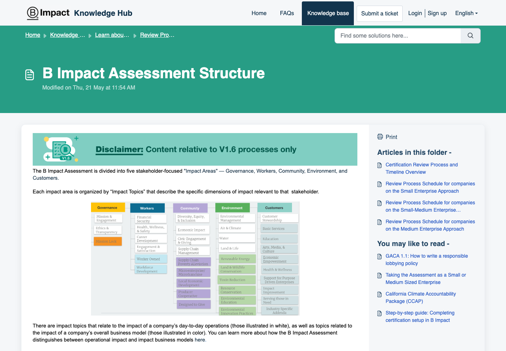
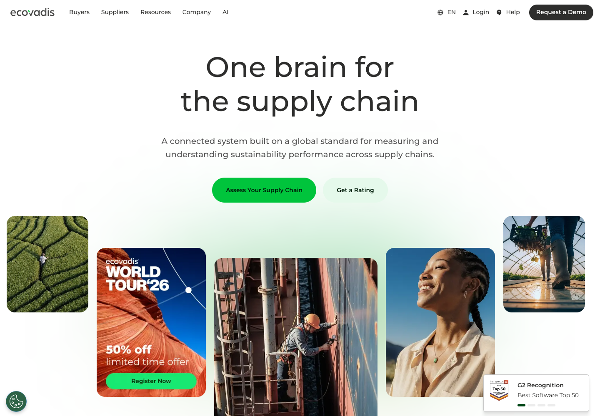
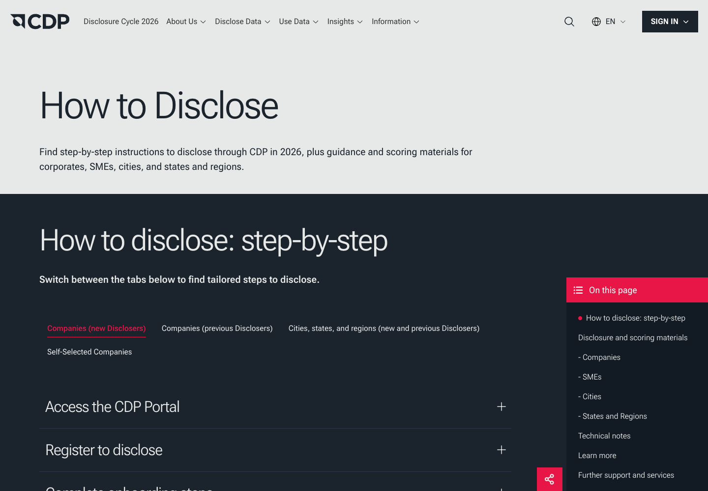
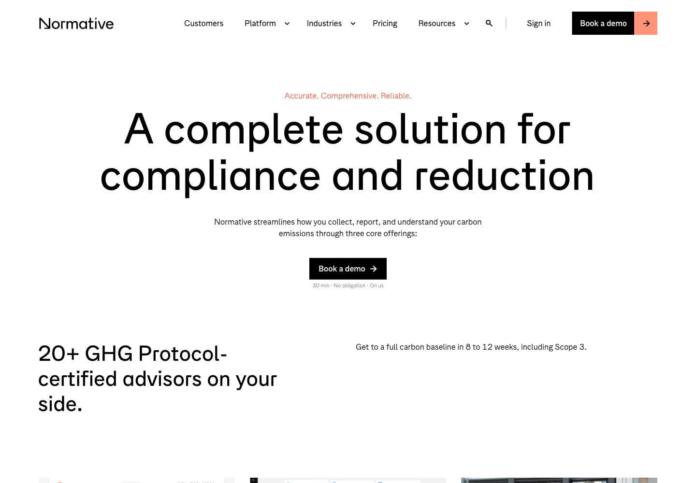
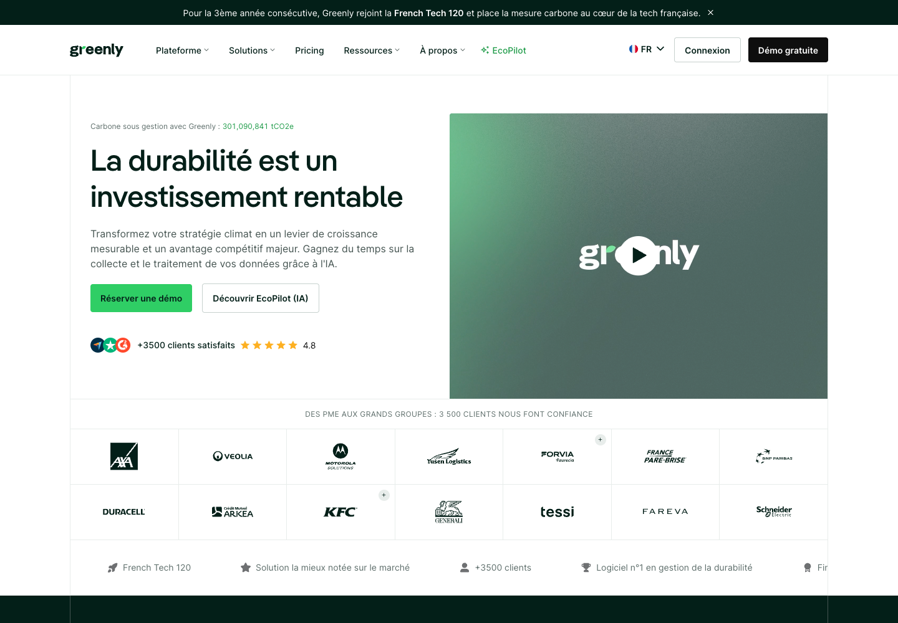

# Análise de competidores e alternativas

## 1. Introdução

O Impacta ESG foi pensado para pequenas e médias empresas que reconhecem a importância do ESG, mas ainda não transformaram o tema em rotina. Nesta análise, observamos cinco produtos que ajudam empresas a medir, reportar ou melhorar práticas de sustentabilidade.

O objetivo foi entender o que funciona nessas soluções, quais pontos podem dificultar o uso por uma PME e onde existe espaço para uma ferramenta mais simples.

## 2. Produtos analisados

### 2.1 B Impact Assessment: B Lab

**Visão geral**

O B Impact Assessment é uma autoavaliação de impacto empresarial associada à plataforma B Impact. A avaliação é adaptada ao tamanho, setor e localização da empresa e organiza perguntas por áreas de impacto. É utilizada tanto para medir impacto quanto como etapa de preparação para a certificação B Corp.

**Funcionamento**

1. A empresa informa dados de escopo e características do negócio.
2. A plataforma gera uma avaliação personalizada.
3. A pessoa responde perguntas sobre governança, trabalhadores, comunidade, ambiente e clientes.
4. A empresa reúne evidências, identifica pontos de melhoria e acompanha a evolução.

**Evidência visual**

Fonte: [página oficial sobre a estrutura do B Impact Assessment](https://kb.bimpactassessment.net/en/support/solutions/articles/43000574682-b-impact-assessment-structure).

**Pontos fortes**

- Avaliação holística, com visão de diferentes partes interessadas.
- Possui orientação específica para pequenas e médias empresas.
- Conecta perguntas a boas práticas e evidências.
- Estimula a formalização de políticas, e não apenas ações pontuais.

**Pontos fracos**

- A quantidade de perguntas e a necessidade de evidências podem intimidar uma PME que está começando.
- O foco em certificação e conformidade pode parecer distante de benefícios operacionais imediatos.
- A pontuação não explica, por si só, qual ação é mais simples para começar amanhã.

### 2.2 EcoVadis Sustainability Intelligence Platform

**Visão geral**

A EcoVadis oferece avaliações e scorecards de sustentabilidade para cadeias de fornecimento. A plataforma consolida dados de fornecedores em uma visão comparável e usa uma metodologia relacionada a referências como UN Global Compact, GRI e ISO 26000.

**Funcionamento**

1. Uma organização solicita ou inicia uma avaliação de sustentabilidade.
2. A empresa avaliada responde questionários e apresenta políticas, ações e resultados.
3. A avaliação combina tecnologia e análise especializada.
4. O resultado aparece como scorecard, permitindo comparação e priorização de riscos na cadeia.

**Evidência visual**

Fonte: [página oficial da plataforma EcoVadis](https://ecovadis.com/).

**Pontos fortes**

- Torna a comparação entre empresas e fornecedores mais objetiva.
- Conecta sustentabilidade a compras, risco e relacionamento comercial.
- Combina automação com revisão de especialistas.
- Abrange temas ambientais, sociais e de ética.

**Pontos fracos**

- A experiência é orientada principalmente a avaliações de fornecedores e grandes cadeias.
- Questionários e evidências podem ter linguagem e esforço excessivos para uma microempresa.
- O scorecard mostra a posição, mas não necessariamente traduz o próximo passo em uma tarefa curta.

### 2.3 CDP Disclosure

**Visão geral**

O CDP opera um sistema de divulgação ambiental para empresas, investidores e governos. A organização disponibiliza questionários, orientações e materiais de pontuação; também mantém uma trilha específica para pequenas e médias empresas.

**Funcionamento**

1. A organização acessa o portal e configura seu questionário.
2. Preenche informações sobre clima e outros temas ambientais aplicáveis.
3. Envia a divulgação dentro do ciclo definido.
4. Recebe orientação e pontuação conforme a metodologia vigente.

**Evidência visual**

Fonte: [guia oficial de divulgação do CDP](https://www.cdp.net/en/disclose/how-to-disclose).

**Pontos fortes**

- Referência reconhecida para transparência ambiental.
- Possui questionário e materiais próprios para PMEs.
- Ajuda a transformar dados ambientais em uma comunicação estruturada.
- Oferece orientação e critérios de pontuação claros.

**Pontos fracos**

- A experiência é centrada em divulgação ambiental, não em um ciclo completo de ESG.
- A linguagem de disclosure e score pode afastar quem ainda não mede indicadores básicos.
- O retorno para a operação da PME fica menos visível do que a obrigação de reportar.

### 2.4 Normative

**Visão geral**

A Normative oferece uma plataforma de contabilidade de carbono com dados para os escopos 1, 2 e 3, cálculo alinhado ao GHG Protocol, planos de redução e apoio de especialistas.

**Funcionamento**

1. A empresa coleta e envia dados de atividades e fornecedores.
2. A plataforma classifica os dados e aplica fatores de emissão.
3. A empresa consolida a linha de base e acompanha reduções.
4. Relatórios e planos orientam decisões e divulgações.

**Evidência visual**

Fonte: [página oficial da plataforma Normative](https://normative.io/platform/).

**Pontos fortes**

- Alta profundidade no tema de emissões e rastreabilidade dos cálculos.
- Conecta medição a planos de redução e metas.
- Ajuda a organizar coleta de dados e preparação para auditoria.
- Mostra como uma boa plataforma transforma dado técnico em decisão.

**Pontos fracos**

- O foco principal é carbono, não a visão equilibrada de E, S e G.
- A coleta de dados e a implantação podem exigir tempo, conhecimento e apoio especializado.
- Para muitas PMEs, o primeiro passo precisa ser mais curto e menos técnico.

### 2.5 Greenly

**Visão geral**

A Greenly se posiciona como uma solução de contabilidade de carbono e gestão climática para empresas de diferentes portes. A plataforma divulga recursos de avaliação de GEE, planos de descarbonização, conformidade ESG e relatórios.

**Funcionamento**

1. A empresa conecta ou informa dados de atividade.
2. O sistema calcula a pegada de carbono e organiza as fontes.
3. A empresa acompanha insights, metas e oportunidades de redução.
4. A plataforma apoia a preparação de relatórios e decisões climáticas.

**Evidência visual**

Fonte: [página oficial da Greenly](https://greenly.earth/).

**Pontos fortes**

- Posicionamento de acessibilidade para empresas de diferentes portes.
- Experiência centrada em visualização, automação e redução de trabalho manual.
- Mostra com clareza a relação entre pegada, plano e redução.
- A proposta é próxima de uma rotina operacional, não apenas de um relatório.

**Pontos fracos**

- A jornada é predominantemente climática e ambiental.
- Uma PME ainda precisa interpretar como conectar dados ambientais a pessoas e governança.
- A dependência de dados de atividade pode ser uma barreira para quem começa sem histórico.

## 3. Benchmark

| Critério | B Impact Assessment | EcoVadis | CDP | Normative | Greenly | Oportunidade para o Impacta |
| --- | --- | --- | --- | --- | --- | --- |
| Diagnóstico inicial | Holístico e detalhado | Questionário e scorecard | Ambiental | Carbono | Carbono | Diagnóstico curto em E, S e G |
| Plano de ação | Orientações e requisitos | Melhorias na cadeia | Recomendações ambientais | Redução e metas | Descarbonização | Próximo passo priorizado por impacto e esforço |
| Indicadores | Pontuação e áreas de impacto | Score comparável | Score de divulgação | Emissões rastreáveis | Pegada e redução | Benefício operacional em linguagem simples |
| Social e governança | Forte | Presente em temas de sustentabilidade | Limitado | Secundário | Parcial | Três dimensões equilibradas desde o início |
| Adequação para PME iniciante | Média | Média/baixa | Média | Média/baixa | Média/alta | Experiência curta, guiada e sem jargão |
| Colaboração | Evidências e equipe | Cadeia e analistas | Portal e divulgação | Tarefas e consultor | Dados e insights | Divisão de responsáveis por ação |

## 4. Requisitos obtidos

1. **Diagnóstico adaptado à empresa:** o questionário deve considerar o porte e o setor para não tratar negócios diferentes da mesma forma.
2. **Próxima ação bem definida:** cada resultado deve indicar uma ação, seu esforço, prazo, impacto esperado e possível benefício.
3. **Registro simples de evidências:** a empresa deve conseguir informar fonte, responsável e data do indicador mesmo que ainda não tenha uma documentação completa.
4. **Equilíbrio entre E, S e G:** o produto deve tratar ambiente, pessoas e governança desde o diagnóstico, sem reduzir ESG a carbono.
5. **Evolução fácil de entender:** o sistema deve comparar ponto de partida, meta e próximo marco em vez de mostrar apenas uma nota.
6. **Linguagem direta:** cada recomendação deve explicar o que fazer, por que fazer e qual resultado pode aparecer.

## 5. Fontes consultadas

- [B Impact Assessment: estrutura](https://kb.bimpactassessment.net/en/support/solutions/articles/43000574682-b-impact-assessment-structure)
- [B Impact Assessment: orientação para PMEs](https://kb.bimpactassessment.net/en/support/solutions/articles/43000575261-taking-the-assessment-as-a-small-or-medium-sized-enterprise)
- [EcoVadis: Sustainability Intelligence Platform](https://ecovadis.com/)
- [CDP: How to disclose](https://www.cdp.net/en/disclose/how-to-disclose)
- [Normative: Platform](https://normative.io/platform/)
- [Greenly: Carbon and ESG platform](https://greenly.earth/)
